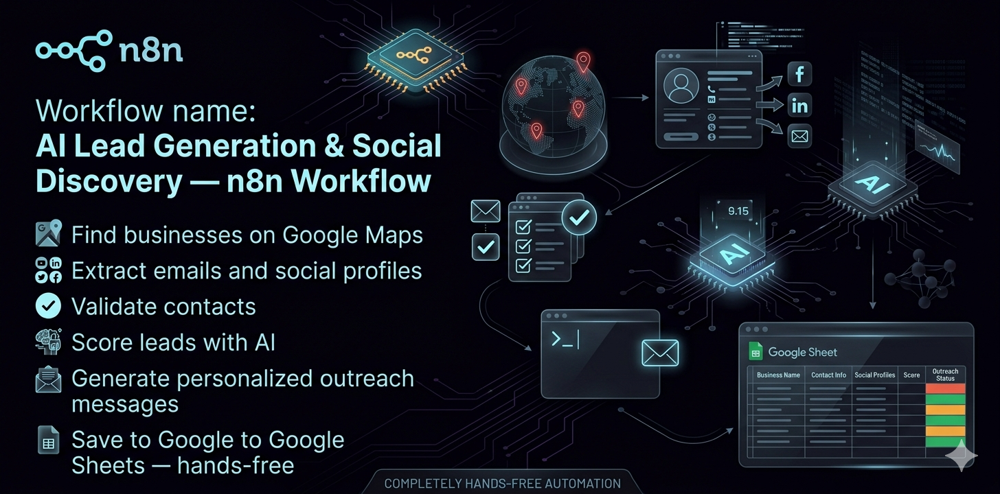
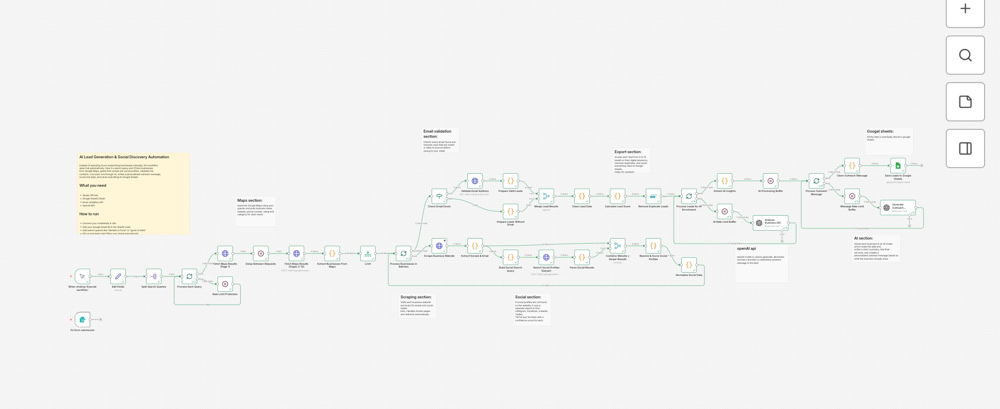

# 🗺️ AI Lead Generation & Social Discovery — n8n Workflow

> Automatically find businesses on Google Maps, extract their emails and social profiles, validate contacts, score leads with AI, generate personalized outreach messages, and save everything to Google Sheets — hands-free.

---

## 📽️ Demo

🎥 **Watch the workflow in action:** [View Demo Video](https://www.loom.com/share/8528370fec2345da9ad477b772ced759)

---

## 🖼️ Workflow Overview


*Complete n8n workflow — from Google Maps search to AI-enriched leads in Google Sheets*

---

## 💡 What Problem This Solves

Manually researching local businesses for outreach takes hours — finding websites, digging for emails, checking social profiles, writing custom messages. Most lead gen tools give you a spreadsheet. This workflow gives you a full pipeline.

You type a search query like `"dentists in Lahore"` or `"gyms in Dubai"` — and within minutes your Google Sheet fills up with verified leads, their social handles, an AI-written business summary, a personalized cold outreach message, and a lead score from 0 to 10.

---

## ✅ What It Does

1. **Accepts search queries** via a built-in form trigger (e.g. `dentists in Pune`, `gyms in Delhi`)
2. **Searches Google Maps** across up to 12 pages of results per query using the Serper API
3. **Extracts business data** — name, phone, website, rating, and business type
4. **Scrapes each business website** for email addresses and social media links (Instagram, Facebook, LinkedIn, Twitter/X, YouTube, TikTok)
5. **Runs a backup social search** via Serper for any profiles not found on the website, with confidence scoring
6. **Validates every email** address before saving — removes invalid or likely-to-bounce contacts
7. **Analyses each business with AI** — generates a one-sentence summary and lists their core services
8. **Writes a personalized cold outreach message** per lead using a B2B copywriting prompt
9. **Scores each lead 0–10** based on digital presence (email, website, socials)
10. **Removes duplicate leads** and saves everything clean to Google Sheets

---

## 🛠️ Tools & Integrations

| Tool | Purpose |
|------|---------|
| **Serper API** | Google Maps search + social profile discovery |
| **Google Sheets** | Lead output and storage |
| **OpenAI (GPT-4o Mini)** | Business analysis + outreach message generation |
| **Email Validation API** | Verifies email deliverability before saving |
| **n8n** | Workflow automation engine |

> The AI nodes are compatible with any OpenAI-compatible API endpoint (Ollama, Groq, Mistral, Together AI, Anthropic).

---

## 📋 Prerequisites

Before importing this workflow, make sure you have:

- [ ] **n8n** — Cloud or self-hosted (v1.0+)
- [ ] **Serper API key** — Get one free at [serper.dev](https://serper.dev)
- [ ] **OpenAI API key** — Or any compatible LLM endpoint (see AI Setup below)
- [ ] **Email Validation API key** — e.g. [Reoon](https://reoon.com), [MillionVerifier](https://millionverifier.com), or similar
- [ ] **Google account** — For Google Sheets OAuth connection

---

## ⚙️ Setup Instructions

### Step 1 — Import the Workflow
1. Download the `workflow.json` file
2. Open your n8n instance
3. Click **+** → **Import from file**
4. Select the downloaded JSON file

### Step 2 — Connect Your Credentials

In n8n, go to **Credentials** and add the following:

**Serper API**
- Node: `Fetch Maps Results (Page 1)` and `Search Social Profiles`
- Add your Serper API key as an HTTP Header Auth credential
- Header name: `X-API-KEY`

**Google Sheets**
- Node: `Save Leads to Google Sheets`
- Connect via Google OAuth
- Open the node and set your **Google Sheet ID** (found in your Sheet URL)

**Email Validation API**
- Node: `Validate Email Address`
- Add your API key per your provider's documentation

**OpenAI / LLM**
- Nodes: `Analyse Business (AI)` and `Generate Outreach message`
- Connect your OpenAI credential in n8n, or see the AI Setup section below

### Step 3 — Configure the Google Sheet
Create a new Google Sheet with the following column headers in row 1:

```
Name | Phone | Website | Email | Rating | Type | Instagram | Facebook | LinkedIn | Twitter | YouTube | TikTok | Summary | Services | Outreach Message | Lead Score
```

Then paste your Sheet ID into the `Save Leads to Google Sheets` node.

### Step 4 — Test Run
1. Open the workflow and click **Test Workflow**
2. Fill in the form with a search query (e.g. `dentists in Karachi`)
3. Watch the execution — leads will begin filling your Sheet within minutes

---

## 🚀 How to Use

The workflow is triggered by a **form submission**. When you run it:

1. A form appears asking for your **search queries**
2. Enter one or more queries separated by commas (e.g. `gyms in Lahore, dental clinics in Islamabad`)
3. The workflow processes each query, scrapes results, enriches them with AI, and saves to your Sheet

You can also trigger it on a schedule or via webhook by swapping the form trigger node.

---

## 📤 What You Get in Google Sheets

Each row in your output sheet contains:

| Field | Description |
|-------|-------------|
| Name | Business name |
| Phone | Phone number from Google Maps |
| Website | Business website URL |
| Email | Extracted & validated email address |
| Rating | Google Maps star rating |
| Type | Business category |
| Instagram / Facebook / LinkedIn / Twitter / YouTube / TikTok | Social profile URLs |
| Summary | One-sentence AI business description |
| Services | List of core services the business offers |
| Outreach Message | Personalized cold email draft ready to send |
| Lead Score | 0–10 score based on digital presence |

---

## 🤖 AI Setup Options

The workflow uses **GPT-4o Mini** by default. You can swap to any of these:

| Provider | Endpoint URL |
|----------|-------------|
| OpenAI | `https://api.openai.com/v1/chat/completions` |
| Groq | `https://api.groq.com/openai/v1/chat/completions` |
| Together AI | `https://api.together.xyz/v1/chat/completions` |
| Mistral | `https://api.mistral.ai/v1/chat/completions` |
| Anthropic | `https://api.anthropic.com/v1/messages` |

**Using Ollama (local AI)?** Replace the endpoint in both AI nodes:

| Environment | URL |
|-------------|-----|
| Mac (Docker) | `http://docker.for.mac.host.internal:11434/api/generate` |
| Windows/Linux (Docker) | `http://host.docker.internal:11434/api/generate` |
| Local (no Docker) | `http://localhost:11434/api/generate` |
| Remote server | `http://YOUR_SERVER_IP:11434/api/generate` |

> **n8n Cloud users:** Ollama must be publicly accessible via a URL or tunnel (e.g. ngrok).

---

## 🎛️ Customization Tips

**Change the search location or niche**
Just update your form query. The workflow works for any local business type in any city worldwide.

**Adjust how many Google Maps pages to scrape**
The workflow fetches pages 1–12 by default. Open the `Fetch Maps Results (Pages 2–12)` node and remove page entries to reduce results (and API usage).

**Change the outreach message tone**
Open the `Generate Outreach message` node and edit the system prompt to adjust tone, length, or angle (e.g. targeting a specific service you offer).

**Add more output columns**
Open the `Save Leads to Google Sheets` node and map any additional fields from the workflow data to new columns.

---

## 🔧 Troubleshooting

**No leads appearing in Google Sheets**
- Check that your Google Sheet ID is correctly set in the Sheets node
- Confirm your Serper API key is active and has credits remaining

**Emails showing as invalid**
- Some businesses use obfuscated emails or contact forms only — this is expected behaviour
- Leads without emails are still saved to the Sheet with other data intact

**AI nodes returning errors**
- Confirm your OpenAI API key is valid and has credits
- If using Ollama, ensure your endpoint URL is reachable from your n8n environment

**Rate limit errors from Serper**
- The workflow includes built-in rate limit buffers. If you hit limits on large query sets, increase the wait times in the `Rate Limit Protection` and `Delay Between Requests` nodes

**Workflow runs but Sheet stays empty**
- Make sure your Google Sheets OAuth has edit permissions on the target Sheet
- Double-check the Sheet ID (not the full URL — just the ID string between `/d/` and `/edit`)

---

## 📄 License & Usage

- ✅ Personal use allowed
- ✅ Commercial use allowed (use in your own business or for clients)
- ❌ Resale of this template as-is is not permitted

---

## 📬 Support & Contact

Got stuck during setup? Reach out:

- **Email:** ibnbilal313@gmail.com
- **WhatsApp:** +923274067546
- **LinkedIn:** [Hamza Abid](https://www.linkedin.com/in/hamza-abid-kemu)

---

*Built with n8n · Serper API · OpenAI · Google Sheets*
